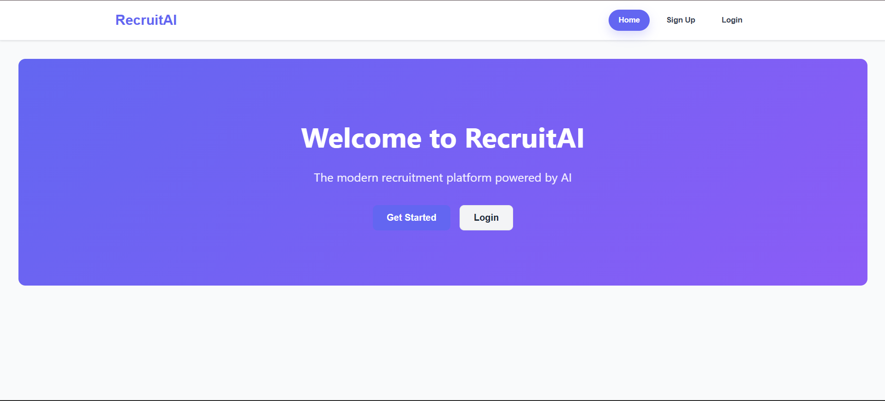
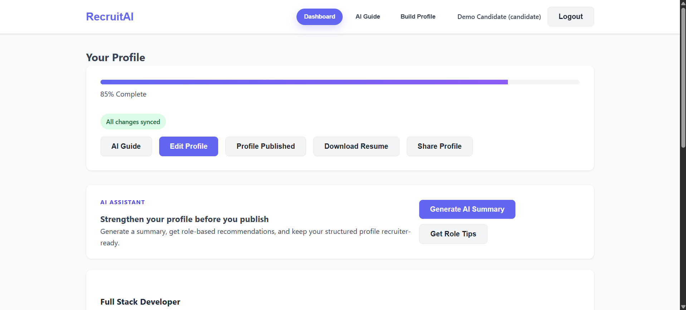
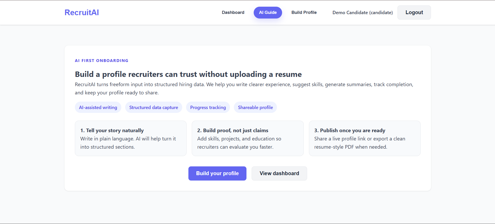
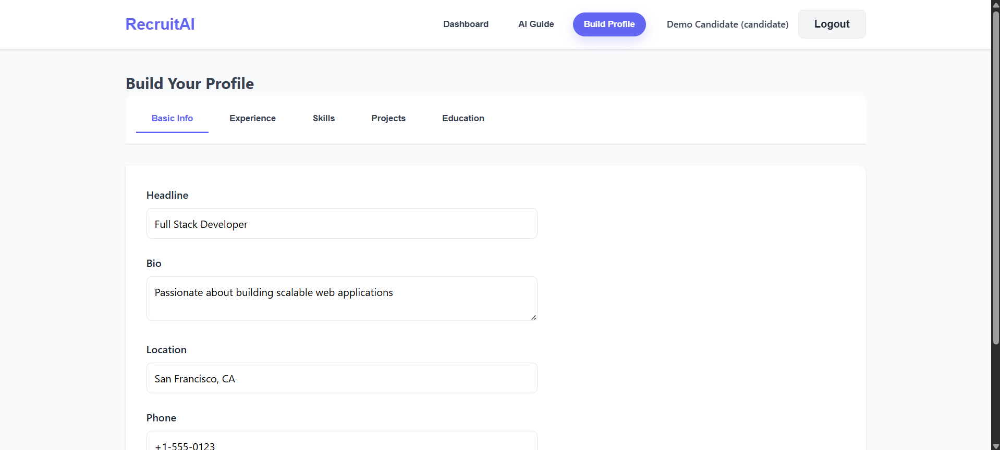
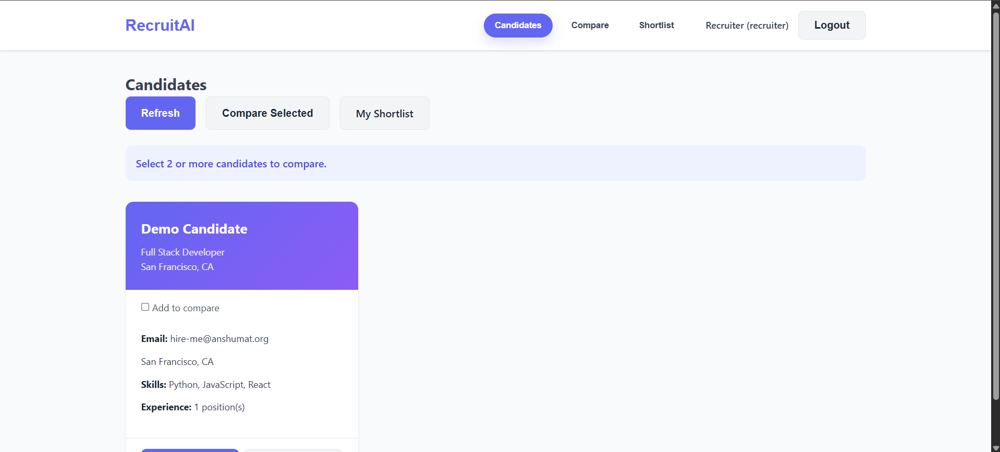
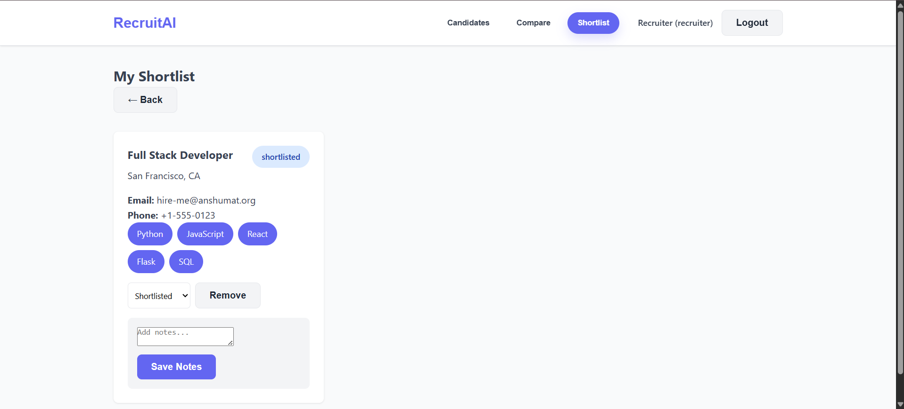

# AI-Powered Recruitment Experience

Structured, AI-assisted hiring platform built for the Web Design Internship assignment. The product replaces resume upload with guided profile creation, recruiter-friendly candidate views, and lightweight AI support across profile building.

## Tech Stack

<p align="left">
  
  
  
  
  
  
  
</p>

## Product Preview

### Candidate Experience

<p align="center">
  
  
</p>

<p align="center">
  
  
</p>

### Recruiter Experience

<p align="center">
  
  
</p>

## Assignment Fit

### 1. Problem Understanding

Traditional resume-based hiring breaks in predictable ways:
- PDFs are inconsistent, hard to parse, and difficult to compare fairly.
- Candidates hide relevant work inside long narrative documents.
- Recruiters lose time normalizing data before evaluating talent.
- Students and early professionals are penalized when they do not know resume conventions yet.

This project replaces resume upload with structured profile creation:
- candidates enter data section by section
- AI helps convert natural language into structured inputs
- recruiters review normalized candidate information
- progress, sharing, and export happen from the profile itself

### 2. What AI Solves Here

AI is used as an assistive layer, not as a black box:
- freeform experience text can be structured into title, company, duration, and description
- skill suggestions are generated from experience context
- profile summaries are generated automatically
- role-based recommendations tell the candidate what is still weak or missing

## Core Screens

The app includes the required screen coverage for both user groups:
- Landing page
- Sign up / Login
- Candidate onboarding with AI introduction
- AI profile builder
- Profile preview/dashboard
- Recruiter candidate list
- Recruiter candidate detail
- Recruiter shortlist
- Compare candidates
- Confirmation / published state
- Public shared profile

## Information Architecture

### Candidate Data Structure

`User`
- id
- email
- full_name
- user_type

`CandidateProfile`
- user_id
- headline
- bio
- location
- phone
- experiences[]
- skills[]
- projects[]
- education[]
- certifications[]
- profile_completion
- is_published
- created_at
- updated_at

`Shortlist`
- recruiter_id
- candidate_id
- status
- notes
- created_at

### Profile Sections
- Basic information
- Experience
- Skills
- Projects
- Education
- AI summary
- Role-based recommendations
- Publish / share / export actions

## User Flows

### Candidate Flow
1. Land on the product and understand the no-resume proposition.
2. Sign up as a candidate.
3. See AI onboarding and start `Build your profile`.
4. Add basic info, experience, skills, projects, and education.
5. Use AI to structure experience, suggest skills, generate summary, and get recommendations.
6. Watch progress and sync state update while editing.
7. Review profile preview.
8. Publish profile.
9. Copy public profile link or export a resume PDF.

### Recruiter Flow
1. Sign up or log in as recruiter.
2. Browse published candidates.
3. Open detailed candidate profile.
4. Add candidate to shortlist.
5. Compare multiple candidates side by side.
6. Update shortlist status and notes.
7. Remove from shortlist if needed.

## AI Interaction Design

This is the center of the product:
- `Tell me about your experience`
  The candidate writes naturally in a freeform text box. The system structures it into a form the recruiter can scan.
- `Skill suggestions`
  Skills are suggested from experience instead of asking the candidate to remember everything manually.
- `Auto-summary generation`
  The platform generates a short professional summary based on current profile content.
- `Role-based recommendations`
  The system identifies weak spots like missing projects, low completion, or incomplete role clarity.

## Product Thinking

### Save / Sync
- Auto-save for basic profile information
- Incremental save for structured sections
- Sync state indicator: saving, synced, or error
- Completion percentage shown on dashboard

### Export / Share
- Download profile as a resume-style printable PDF
- Copy public profile link
- Open shared public profile without requiring login

## Features Implemented

### Candidate
- Guided onboarding
- Smart profile builder without resume upload
- Structured experience / skills / projects / education entry
- AI-assisted experience structuring
- AI skill suggestions
- AI summary generation
- Role-based profile recommendations
- Auto-save and sync indicator
- Completion tracking
- Profile preview
- Publish confirmation
- Shareable public profile link
- Resume-style PDF export

### Recruiter
- Candidate discovery dashboard
- Candidate detail view
- Compare selected candidates
- Shortlist management
- Status updates
- Notes
- Remove from shortlist

### Stack Breakdown
- Frontend: HTML, CSS, Vanilla JavaScript
- Backend: Flask + MongoEngine
- Database: MongoDB
- Auth: JWT bearer token

## Project Structure

```text
/frontend
  index.html
  styles.css
  app.js

/backend
  app.py
  routes.py
  models.py
  config.py
  requirements.txt

README.md
```

## Setup Instructions

### Prerequisites
- Python 3.8+
- MongoDB running locally or a MongoDB Atlas connection string

### Backend
```bash
cd backend
python -m venv venv
venv\Scripts\activate
pip install -r requirements.txt
copy .env.example .env
python app.py
```

Create `backend/.env` before starting the API:

```env
MONGODB_HOST=mongodb://localhost:27017/ai_recruiter
SECRET_KEY=change-this-secret-key
```

If you use MongoDB Atlas, replace `MONGODB_HOST` with your Atlas connection string.

Backend runs at `http://localhost:5000`.

### Frontend
```bash
cd frontend
python -m http.server 8000
```

Frontend runs at `http://localhost:8000`.

## Demo Login

Mandatory candidate demo user:
- Email: `hire-me@anshumat.org`
- Password: `HireMe@2025!`

Seeded recruiter demo:
- Email: `recruiter@example.com`
- Password: `Recruiter@2025!`

## API Summary

### Auth
- `POST /api/auth/signup`
- `POST /api/auth/login`
- `POST /api/auth/logout`
- `GET /api/auth/me`

### Candidate
- `GET /api/candidate/profile`
- `PUT /api/candidate/profile`
- `POST /api/candidate/profile/publish`

### Recruiter
- `GET /api/recruiter/candidates`
- `GET /api/recruiter/candidate/<id>`
- `POST /api/recruiter/shortlist`
- `PUT /api/recruiter/shortlist/<id>`
- `DELETE /api/recruiter/shortlist/<id>`
- `GET /api/recruiter/shortlist`

### AI
- `POST /api/ai/suggest-skills`
- `POST /api/ai/generate-summary`
- `GET /api/ai/recommendations`
- `POST /api/ai/structure-experience`

### Public Share
- `GET /api/public/profile/<id>`

## Submission Justification

Why this approach fits the assignment:
- It removes resume upload from the core flow.
- It prioritizes structured input over document parsing.
- It demonstrates AI as a UX layer, not just decorative copy.
- It supports both sides of the hiring marketplace.
- It includes product thinking beyond UI: save/sync, progress, export, and share.

## Notes
- AI endpoints are lightweight rule/placeholder implementations suitable for assignment evaluation and flow demonstration.
- PDF export uses the browser print flow so reviewers can save the generated resume as PDF directly.
- Demo users are seeded automatically when the backend starts.
- The repo includes `backend/.env.example` so reviewers can set up the backend quickly.
